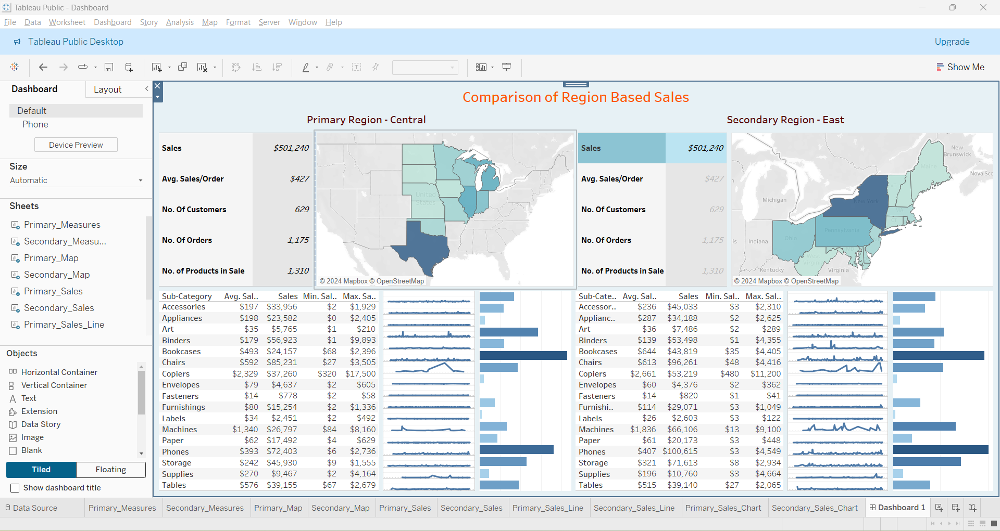

# Region-Based Sales Comparison Dashboard

## Project Description

The **Region-Based Sales Comparison Dashboard** is a Tableau project designed to help organizations compare sales between two selected regions. The dashboard provides an insightful visualization of sales data, enabling upper management to identify patterns, assess regional performance, and suggest necessary improvements.

This project uses the **Sample Superstore** dataset and follows a step-by-step approach to organize, analyze, and visualize the data for clear comparison. The final output is an interactive dashboard with detailed sales insights for two regions.

## Objective

The main objective of this project is to:

- Create a dynamic Tableau dashboard to visualize sales data by region.
- Provide meaningful metrics and KPIs, such as total sales, average sales per order, number of customers, orders, and products sold.
- Enable upper management to compare sales performance between two selected regions and draw actionable conclusions.

## Key Features

1. **Interactive Parameters**:
   - Primary Region and Secondary Region parameters to allow region selection for comparison.

2. **KPIs Displayed**:
   - **First Order Date**: Date of the first recorded sale for each region.
   - **Total Sales**: Aggregate sales for the selected region.
   - **Average Sales per Order**: Total sales divided by the number of orders.
   - **Number of Customers**: Total customers in the region.
   - **Number of Orders**: Count of total orders placed.
   - **Number of Products in Sale**: Count of unique products sold.

3. **Visualizations**:
   - Line graphs and bar graphs illustrating sales trends and sub-category sales breakdown for both regions.

4. **Hierarchical Data Representation**:
   - Organized by `Country` for streamlined insights.

5. **Dynamic Data Partitioning**:
   - Comparison of metrics and visualizations between two user-selected regions.

## Steps to Recreate the Dashboard

### Step 1: Data Selection and Organization

- **Dataset**: Use the **Sample Superstore** dataset.
- Create a folder in the data source to group relevant data (e.g., Customer Name and Order ID) for better organization.

### Step 2: Create a Hierarchy

- Add a hierarchy named **Location** for the `Country` variable.

### Step 3: Parameter Creation

- Create two parameters: **Primary Region** and **Secondary Region** with all available regions.
- Add calculated fields for both parameters to enable dynamic filtering.

### Step 4: Date Field

- Create a calculated field named **First Order Date** to extract the first recorded sale date for each region.

### Step 5: Dashboard Development

- Arrange all metrics and visualizations into a Tableau dashboard:
  - KPIs for each region.
  - Line and bar graphs showing sales trends and sub-category performance.
- Partition the dashboard into two sections for **Primary Region** and **Secondary Region**.

### Step 6: Publish

- Publish the dashboard to Tableau Public.

### Sample Output

The final dashboard includes the following:

1. **KPIs Section**:
   - Sales metrics for the selected primary and secondary regions.

2. **Visualizations**:
   - Line graphs comparing sales trends.
   - Bar charts displaying sales by sub-category.

3. **Interactive Parameters**:
   - Allow users to select and compare regions dynamically.

### Tableau Public Link

Access the published dashboard here: [Region-Based Sales Comparison Dashboard](https://public.tableau.com/app/profile/shintu.mon/viz/RegionBasedSalesComparisonDashboard/Dashboard1)

## Project Screenshots

---
